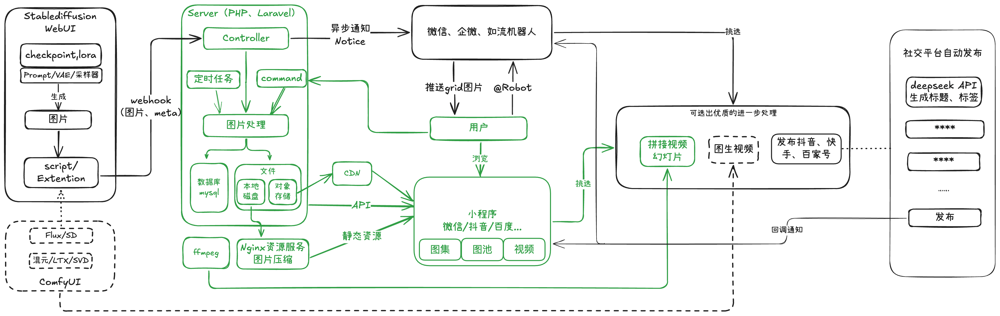

<!-- PROJECT LOGO -->
<br />

<!-- PROJECT LOGO -->
<p align="center">
  <a href="https://github.com/shaojintian/Best_README_template/">
    
  </a>

  <h3 align="center">🎨奇绘图册</h3>
  <p align="center">
    一款帮AI绘画爱好者维护绘图作品的小程序
    <br />
    <a href="https://github.com/shaojintian/Best_README_template">查看Demo</a>
    ·
    <a href="https://github.com/shaojintian/Best_README_template/issues">反馈</a>

</p>

> 此项目为服务端部分，小程序端参见：[微信小程序](https://github.com/WYQilin/aigallery)
 
## 目录

- [上手指南](#上手指南)
  - [开发前的配置要求](#开发前的配置要求)
  - [安装步骤](#安装步骤)
- [文件目录说明](#文件目录说明)
- [开发的架构](#开发的架构)
- [部署](#部署)
- [使用到的框架](#使用到的框架)
- [贡献者](#贡献者)
  - [如何参与开源项目](#如何参与开源项目)
- [版本控制](#版本控制)
- [作者](#作者)
- [鸣谢](#鸣谢)

## 📖项目介绍
「奇绘图册」一款帮AI绘画爱好者记录和维护绘图作品的小程序。旨在让大家能够便捷的拥有一个个人画廊工具。

<div align="center">
    
</div>

完整的项目结构如图，其中**绿色部分**是目前开源的内容。**虚线部分**由于我的Mac M3带不动图生视频模型甚至flux也很吃力，所以本项目主要基于SD及webui实现，理论上都适用，但兼容性未做过多测试，可能存在问题。

**社交平台自动发布部分**不准备分享，因为喜闻乐见的一公布就容易被封禁失效，有兴趣的可以交流探讨，也可开动脑筋自行实现。

**群聊机器人部分**由于wechaty等群聊机器人年底全被封了，企业群聊机器人又只能加入组织后才能体验，展示demo十分不便，所以没有整理这部分，也暂不做讨论。后续整理完代码后开源，目前代码实现有点乱，感兴趣的同学可以先关注一波。

## 📦安装部署
### 开发前的配置要求
- 本项目后端基于`php`开发，使用当前最新的`laravel11`框架，依赖`php8.2`及以上版本。
- 数据库建议使用`mysql8.0`及以上版本。
- 图片拼接视频依赖`ffmpeg4.4`及以上版本。
- 您也可以选择通过docker快速部署demo。


### 快速开始

**🔔项目提供了一键部署脚本，可以直接运行`bash deploy.sh`（确保网络/代理畅通）**

会优先检测php版本符合要求执行本地部署；不符合要求时执行docker部署。

其中deploy.sh运行时支持图片路径参数即`bash deploy.sh 你的图片目录`，不指定路径时默认使用项目根目录的demo文件夹

```shell
git clone https://github.com/WYQilin/aigallery-server
cd aigallery-server
sh deploy.sh
# 或 sh depoly.sh 你的图片目录
```
三行指令即可完成安装，部署完成后到小程序查看即可。


### ~~手动安装~~
略，参考deploy.sh

### ~~使用docker安装~~
略，参考deploy.sh


### 📧 联系作者
- 有问题和建议请提issue（首选）
- 通过小程序底部按钮可报bug和联系“客服”
- 可以关注我的[博客](http://xiaobaiqi.blog.csdn.net)并私信


### ©️版权说明
 
该项目采用 [Apache-2.0 License](LICENSE) 授权许可，详情请参阅。

### 🔗鸣谢


- [Laravel](https://www.webpagefx.com/tools/emoji-cheat-sheet)
- [StableDiffusion](https://shields.io)
- [~~七牛云~~]()（求一个对象存储赞助，demo的服务器带宽太小了，图片加载吃力）


